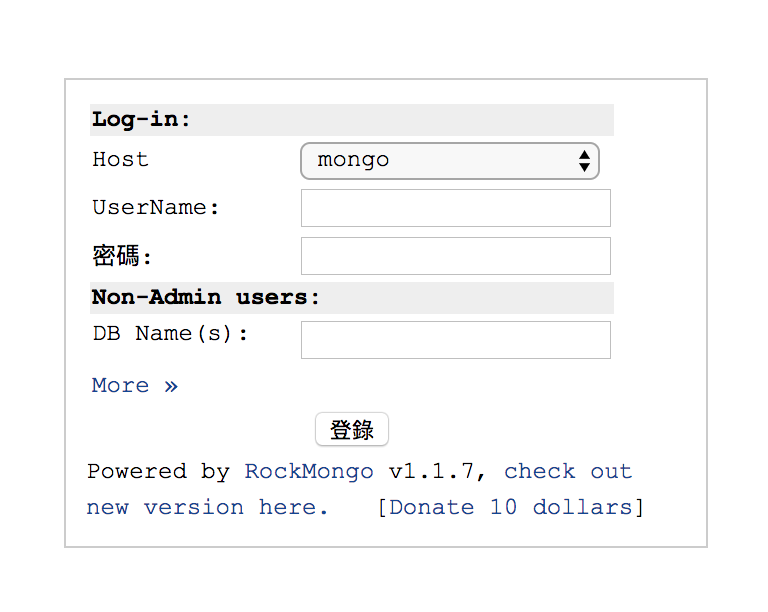
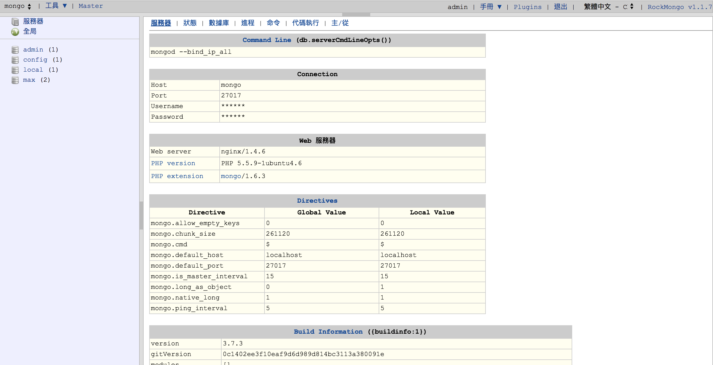

# how to use

1. Update the config.php
  - don't forget to check 'mongo_host', or make sure the 'networks' like mongodb env
2. `docker-compose up -d`
3. browser : 'http://localhost:27018'
  - default admin/admin

